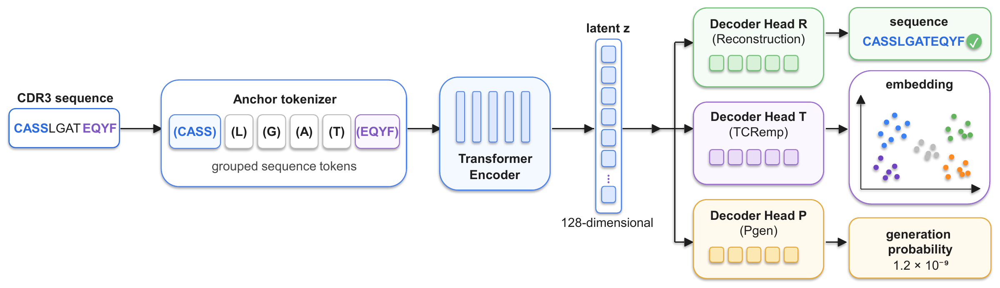

# RTP-CODEC



**Learning Compact TCR Representations from Multiple Biological Objectives**<br>
**Accepted to BioFM @ ICDM'26**

Elizaveta Vlasova · Petr Grigorev · Mariia Demidova · Sergey Muravyov · Mikhail Shugay

RTP-CODEC learns a **128-dimensional TRB CDR3 representation** through sequence reconstruction (**R**), TCRemP supervision (**T**) and generation-probability prediction (**P**). After training, encoding requires only the amino-acid sequence.

[Quick start](#quick-start) · [Reproduce the paper](docs/reproduction.md) · [Results](research/results/paper/README.md) · [Documentation](docs/README.md)

## Quick start

Python 3.11+; install from the repository root:

```bash
python -m pip install -e .
```

Encode an input TSV with a `junction_aa` column:

```bash
rtp-codec encode \
  --checkpoint /path/to/best.pt \
  --tokenizer /path/to/anchored_tokenizer.json \
  --input research/examples/data/sequences.tsv \
  --output artifacts/latents.npy
```

This writes one vector per input row, preserving order. Model weights, tokenizer bundles and the locked dataset are separate assets; see [asset requirements](docs/assets.md). Installation options, the Python API and training examples are in the [usage guide](docs/usage.md).

## Repository

| Directory | Contents |
| --- | --- |
| [`src/`](src/) | Installable `rtp_codec` library and CPU tests |
| [`research/`](research/README.md) | Paper configurations, results, launchers, examples and historical notebooks |
| [`docs/`](docs/README.md) | Usage, reproduction, architecture and migration guides |

The diagram above is the original first figure from the final manuscript, rendered for GitHub; its [vector PDF](docs/figures/model-schematic.pdf) is preserved.

## Citation

**Accepted to BioFM @ ICDM'26.**

```bibtex
@inproceedings{vlasova2026rtpcodec,
  title = {RTP-CODEC: Learning Compact TCR Representations from Multiple Biological Objectives},
  author = {Vlasova, Elizaveta and Grigorev, Petr and Demidova, Mariia and Muravyov, Sergey and Shugay, Mikhail},
  booktitle = {BioFM @ ICDM'26},
  year = {2026},
  note = {Accepted}
}
```

Software citation metadata: [CITATION.cff](CITATION.cff). Code license: [GPL v3](LICENSE).
