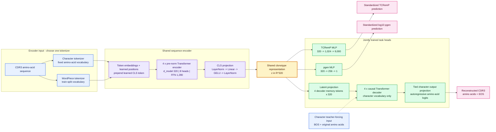

# Proposed joint IRRM-CODEC Transformer

## Scope

The first manuscript-ready version should use the human TRB benchmark from PR #2 and
encode only the CDR3 amino-acid sequence. It should produce one compact latent vector
and train all three endpoints jointly. The old forward, inverse, and pgen models remain
separate baselines; their published metrics must not be presented as results from this
joint architecture.

## Default architecture

The encoder tokenizer is the only architectural alternative. Both variants share the
same 320-dimensional bottleneck and task heads, while reconstruction always uses the
fixed character vocabulary and must pass through the compact latent vector.

- Input tokenization: two directly comparable model variants should be trained:
  character-level amino acids and WordPiece tokens. Both use the same fixed benchmark
  splits, Transformer architecture, 320-D bottleneck, heads, and optimization setup.
- Reconstruction output: always character-level amino acids with PAD/BOS/EOS special
  tokens. A WordPiece-input model therefore uses separate encoder and decoder embedding
  tables; the decoder embedding remains tied to its character output projection.
- Encoder: learned positional embeddings, a learned CLS token, four pre-norm
  Transformer layers, 320 hidden units, eight attention heads, and a 1,280-unit feed-forward block.
- Bottleneck: one 320-dimensional, layer-normalized vector. This is close to the
  requested approximately 300 dimensions and divides evenly across eight attention heads.
- TCRemP head: 320 → 1,024 → 9,000. It predicts train-standardized TCRemP coordinates.
- Pgen head: 320 → 256 → 1. It predicts standardized `log10_pgen_1mm`.
- Reconstruction head: a causal four-layer Transformer decoder. The 320-D latent is
  projected into four decoder memory tokens; the decoder never receives encoder token
  states directly, so reconstruction genuinely passes through the compact bottleneck.
- For the character-input model, encoder and decoder embeddings can be shared. For the
  WordPiece-input model, only the character decoder embedding and output matrix are tied.

Character and WordPiece tokenization are input alternatives, not different output tasks.
The same character-level reconstruction target makes exact-match results comparable
between them. The fork contains WordPiece preparation and sweep code but no committed
executed comparison result, so the tokenizer conclusion must be re-established on the
joint Transformer rather than inherited from the older convolutional experiments.

## Joint objective

The three target types have incompatible scales. TCRemP and pgen targets must be
standardized using train-only statistics. The proposed loss is:

`L = w_emb * (0.7 * MSE_standardized + 0.3 * cosine_raw) + w_pgen * Huber_standardized + w_seq * CE_PAD-aware`

Start with all three task weights equal to one, log each component separately, and only
tune weights if gradient norms or validation curves show one task dominating. Raw-space
TCRemP cosine must be computed after de-standardization; cosine in standardized space is
not sufficient evidence that TCRemP geometry was preserved.

## Training sequence

1. Run the 1k nested split as a pipeline test and deliberate overfit check. Sequence
   exact match should approach 1.0; failure indicates a decoder/data bug.
2. Use the 10k split for latent-size (128/256/320/512), depth, and joint-loss ablations.
3. Freeze the configuration and train once on the full 79,998-example training split.
4. Evaluate once on the fixed 10,001-example test split.

The train/validation/test manifests must be shared across the joint model and every
baseline. De-duplicate by amino-acid sequence before splitting.

## Manuscript-critical evaluation

| Endpoint | Primary metrics | Additional validity checks |
| --- | --- | --- |
| TCRemP imitation | raw-space cosine, MSE | pairwise-distance Spearman correlation; nearest-neighbor overlap |
| Pgen | RMSE, MAE, R², Pearson | residual bias and calibration across pgen deciles |
| Reconstruction | exact match, token accuracy, edit distance | valid amino-acid fraction; length accuracy |
| Shared latent | three-task result versus single-task encoders | latent-size ablation and loss-weight ablation |
| Codec consistency | encode → decode → re-encode | TCRemP cosine and pgen change after round trip |

The strongest workshop claim is not that each separate predictor works. It is that a
single compact sequence representation preserves TCRemP geometry, generation
probability, and enough sequence information for high-fidelity reconstruction.

## Repository status and legacy notes

- The joint pipeline now has a prepared-benchmark loader, train-only target
  standardization, char/WordPiece inputs with character reconstruction, a training CLI,
  checkpoint resume, raw-space metrics, prediction export, comparison runners, tests,
  and local/Slurm launchers.
- The actual AIRR table, TCRemP matrix, pgen cache, WordPiece artifacts, and trained
  checkpoints remain external data/run artifacts and are intentionally not committed.

- `demidovamaria/main` has the newest WordPiece, padding, and convolutional sweep code,
  but its legacy inverse loop is currently incompatible with `InverseModel` and `losses.py`.
- `antigenomics/wandb` fixes that inverse API and adds W&B sweeps, but it predates and
  conflicts with the newer tokenizer/no-cache work.
- PR #2 supplied the common TRB split contract; benchmark preparation now streams the
  large embedding matrix into a memory-mapped `.npy` file.
- Existing forward metrics use standardized TCRemP targets. The final evaluation must
  also report raw-space geometry after inverse transformation.
